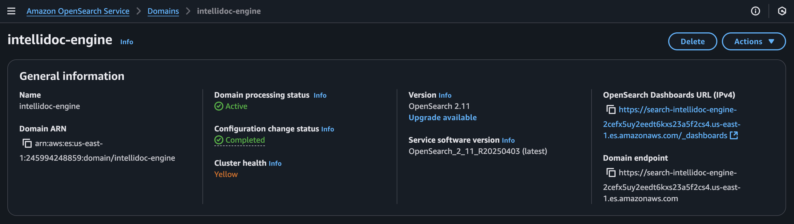

# IntelliDoc Engine — Serverless Document Processor with Textract, SageMaker, and OpenSearch on AWS

  
  
  
  
  
  
  
  


This is a fully serverless document analysis pipeline built on AWS. Users can upload any document (PDF, DOCX, TXT, etc.) via a frontend web app. The pipeline extracts text using **Amazon Textract**, analyzes it in real-time using **SageMaker (DistilBERT)**, and stores the results in **DynamoDB** and **OpenSearch** for instant search and filtering.

The frontend is hosted on **AWS Amplify** with a custom domain via **Route 53**. The backend is deployed entirely via **Terraform**.

---

## Demo

**Watch the full demo on YouTube**  
[Watch the YouTube demo](https://www.youtube.com/watch?v=REPLACE_WITH_YOUR_LINK)

---

## Architecture


---

## UI

**Upload + Search UI**  


**Search Results**  


---

## How It Works

1. **User** uploads a file via the Amplify frontend  
   
2. File is stored in S3 and **TextractProcessor Lambda** is triggered  
   
3. Textract extracts raw text and **SNS** sends event to `MLAnalyzer`  
   
4. `MLAnalyzer` calls **SageMaker** endpoint (DistilBERT)  
   
5. `MLAnalyzer` invokes `SaveAndIndex`  
   
6. `SaveAndIndex` writes metadata to **DynamoDB**  
   
7. Extracted insights are indexed into **OpenSearch**  
   

---

## Deployment with Terraform

```bash
git clone https://github.com/fkv747/terraform-intellidoc-engine.git
cd terraform
terraform init
terraform apply
```

You will deploy:
- ✅ IAM roles & policies  
- ✅ S3 Bucket w/ Textract trigger  
- ✅ SNS Topic + Lambda Triggers  
- ✅ SageMaker Endpoint (DistilBERT)  
- ✅ DynamoDB + OpenSearch  
- ✅ API Gateway  
- ✅ Amplify frontend + Route 53 domain (via Console)

---

## Services Used

| Layer        | Service                           |
|--------------|------------------------------------|
| Frontend     | AWS Amplify + Route 53             |
| Upload       | S3 + Presigned URL via Lambda      |
| Extraction   | Amazon Textract                    |
| AI Inference | SageMaker Real-Time (DistilBERT)   |
| Storage      | DynamoDB                           |
| Search       | OpenSearch                         |
| Event Flow   | SNS + Lambda                       |
| API          | API Gateway (HTTP)                 |
| IaC          | Terraform (backend infrastructure) |

---

## DynamoDB Table

**Table Name:** `IntelliDocMetadata`  
**Partition Key:** `DocumentId` (String)

---

## 🔧 Future Enhancements

- Add document previews to search results  
- Enable advanced filtering in OpenSearch  
- Add session-based search tracking

---

## Connect with Me

📫 [LinkedIn](https://www.linkedin.com/in/franc-kevin-v-07108b111/)
